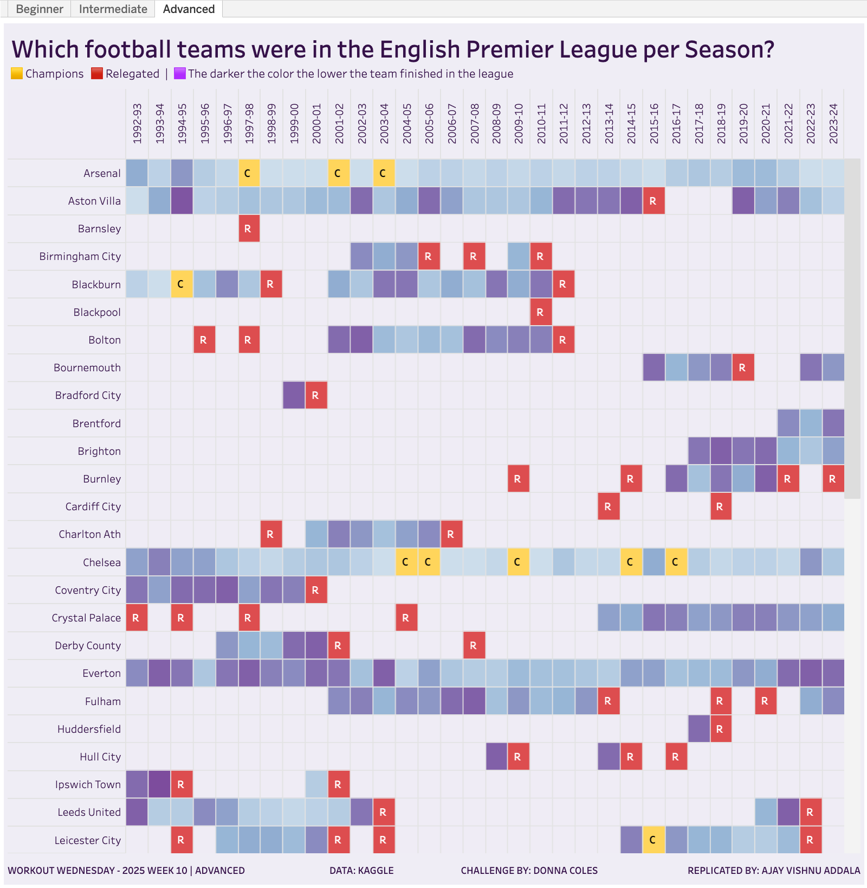

# Workout Wednesday 2025 | Week 10 | Ranking by Multiple Measures

## Challenge Description
This week's challenge focuses on ranking teams in the English Premier League (EPL) based on multiple measures. Teams are ranked by:
1. Total points accumulated (considering point deductions).
2. Goal difference.
3. Goals scored.

We also visualize the data in different levels:
- Beginner: Basic table with team rankings and point information.
- Intermediate: Include champion/relegation statuses.
- Advanced: Additional coloring based on rank for teams not relegated or crowned champions.

## Requirements

### Level 1: Beginner
- Create a tabular display depicting Team by Season.
- Color cells if the team participated in the EPL during that season.
- Determine ranking based on:
  1. Points (adjusted for deductions).
  2. Goal difference.
  3. Goals scored.
- Label the team that finished 1st in each season.
- Include finishing position, points, and notes for deductions in tooltips.
- Match formatting:
  - Background: Pale purple `#f1eff6`
  - Squares: Mid purple `#938bc1`
  - Font: Dark purple `#3d1053`

### Level 2: Intermediate
- Add champion (`C`, `#ffda66`) and relegation (`R`, `#e15759`) statuses.
- Teams relegated are in the bottom 3 (except in 1994-95, where the bottom 4 were relegated).

### Level 3: Advanced
- Color cells for teams that remained in the league based on rank:
  - Use the `BuPu 3 Color Seq Palette` from Color Brewer:
    - `#E0ECF4` (lighter color for higher rank)
    - `#9EBCDA` (mid-range rank)
    - `#8856A7` (darker color for lower rank)

## Visuals

### Snapshot

### Tableau Public Link
[View the Dashboard on Tableau Public](https://public.tableau.com/views/PremierLeagueParticipationandRankingWOW2025W10/Advanced?:language=en-US&:sid=&:redirect=auth&:display_count=n&:origin=viz_share_link)

## Instructions to Recreate

1. **Data Preparation:**
   - Ensure the dataset includes:
     - Team name
     - Season
     - Points
     - Goal difference
     - Goals scored
     - Notes on point deductions (if applicable).

2. **Tableau Steps:**
   - Create calculated fields for ranking measures.
   - Set sorting logic:
     - Rank by points.
     - Break ties using goal difference.
     - Break further ties using goals scored.
   - Design a tabular view with conditional formatting for each level of the challenge.
   - Add tooltip details for rankings and point deductions.
   - Format the table to match the color palette and design requirements.

3. **Formatting:**
   - Apply colors based on the requirements for each level.
   - Use Color Brewer palette for advanced-level ranks.

